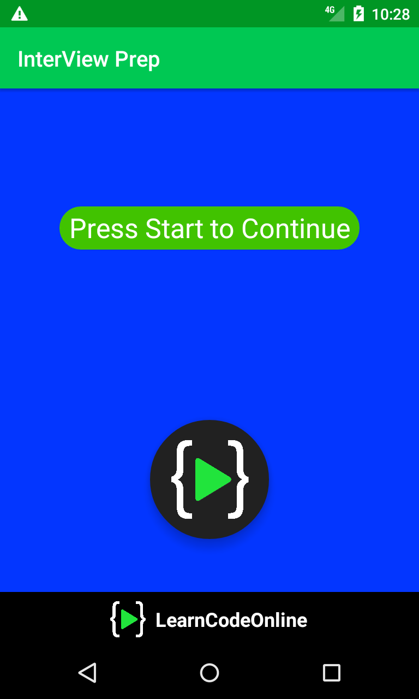
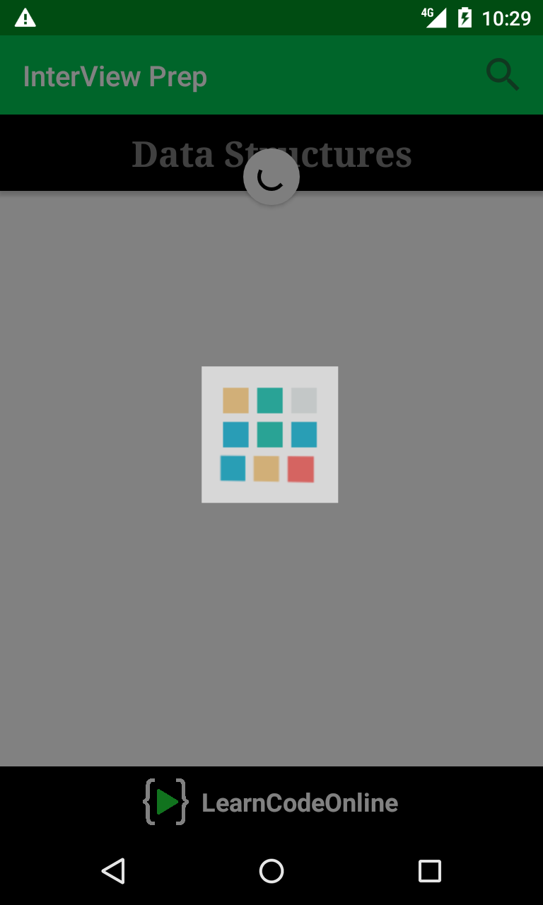
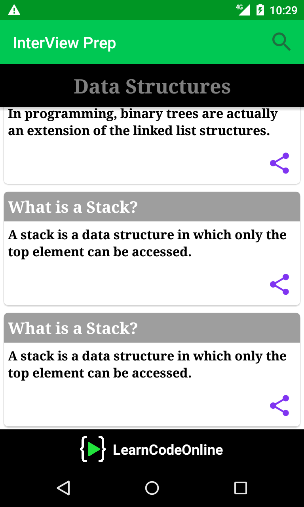

# InterView Prep

Interview Prep. is a basic android app which will help students to learn about data structures.

## Screens for EduVine

## Getting Started

you just need an android device running Android Lollipop 5.1 to run this application provided below:
Download APK file : [Click here to download](https://drive.google.com/open?id=1LLpkaP3aBidZo6GfeZ7cVhrSeQVRL7Ca)

## Contributors

* **Rajarshi Das** - *Initial work* - [devcoderrajarshi](https://github.com/devcoderrajarshi)

## License

This project is licensed under the MIT License - see the [LICENSE.md](LICENSE.md) file for details

